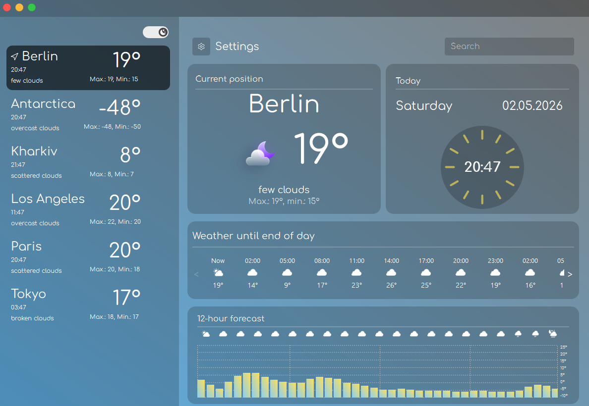
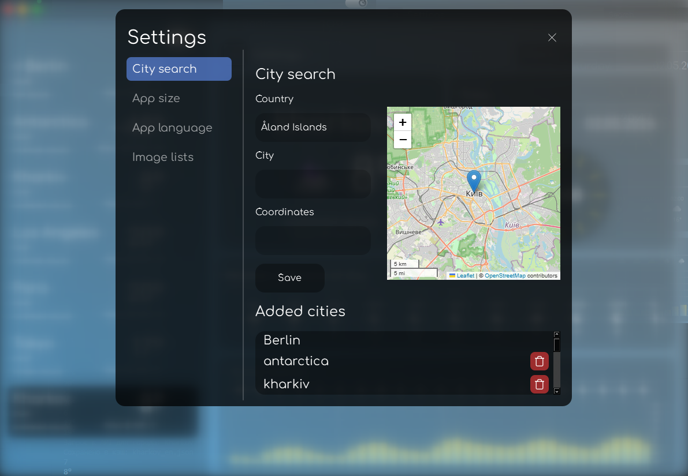
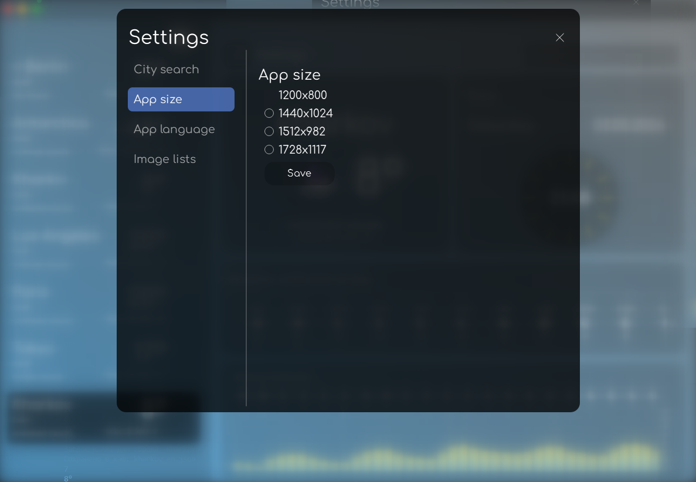
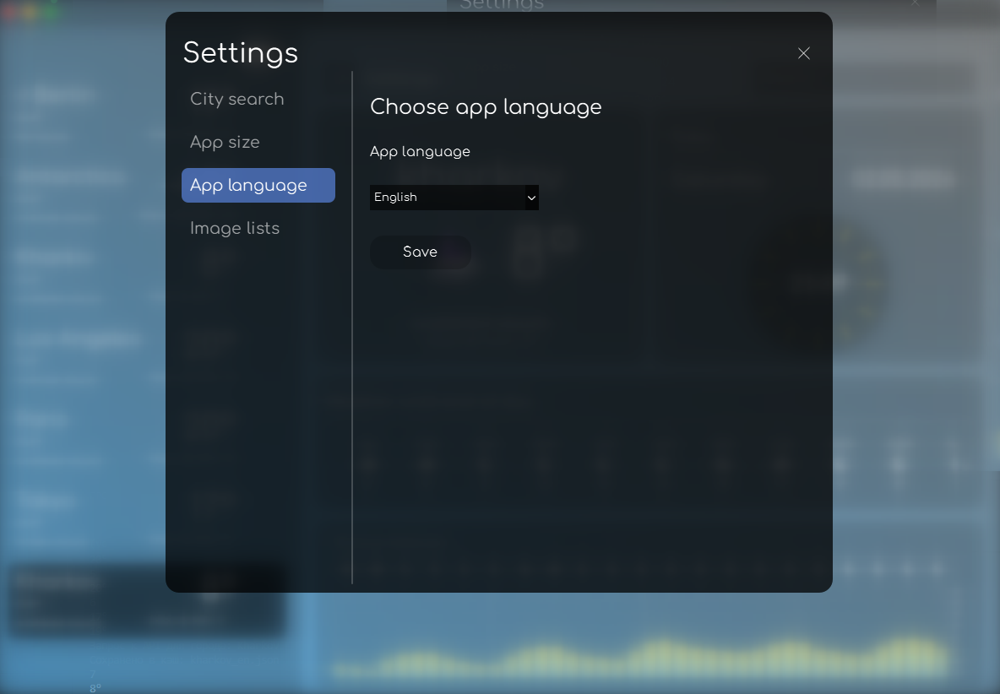
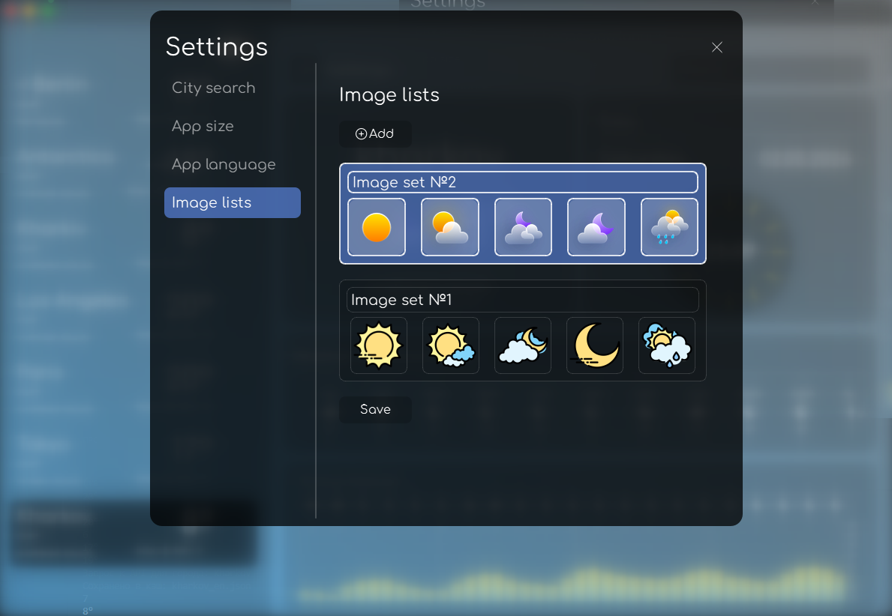

# weatherApp
# 🌦️ Weather App

## 📌 Description

**Weather App** is a simple and user-friendly application that allows users to check current weather conditions and forecasts for any location.
The project provides accurate, real-time weather data with a clean interface.

---

## 🚀 Features

* 🌍 Search weather by city name
* 🌡️ Current temperature and conditions
* 📅 Weather forecast
* 💨 Humidity, wind speed, etc.

---

## 🛠️ Technologies Used

* Python
* PyQt6
* Weather API *(e.g. OpenWeatherMap)*

---

## 📦 Installation

1. Clone the repository:

   ```bash
   git clone https://github.com/your-username/weather_app.git
   ```

2. Go to project folder:

   ```bash
   cd weather_app
   ```

3. Install dependencies:

   ```bash
   pip install -r requirements.txt
   ```

4. Run the app:

   ```bash
   python main.py
   ```

---

## ⚙️ Configuration

Get your API key from OpenWeatherMap 
and add it in the app configuration file.

Example:

```env
API_KEY=your_api_key_here
```

---

## 📸 Screenshots
















---

## 👨‍💻 Authors

* Kiril Maltsev
* Misha Mishenko
* Misha Morozov

---

## 📄 License

MIT License

# 🌦️ Weather App

## 📌 Опис

**Weather App** — це простий та зручний застосунок для перегляду поточної погоди та прогнозу в будь-якому місті.
Проєкт надає точні дані в реальному часі з приємним інтерфейсом.

---

## 🚀 Можливості

* 🌍 Пошук погоди за містом
* 🌡️ Поточна температура та стан
* 📅 Прогноз погоди
* 💨 Вологість, швидкість вітру тощо

---

## 🛠️ Технології

* Python
* PyQt6
* Weather API *OpenWeatherMap*

---

## 📦 Встановлення

1. Клонуйте репозиторій:

   ```bash
   git clone https://github.com/your-username/weather_app.git
   ```

2. Перейдіть у папку проєкту:

   ```bash
   cd weather_app
   ```

3. Встановіть залежності:

   ```bash
   pip install -r requirements.txt
   ```

4. Запустіть застосунок:

   ```bash
   python main.py
   ```

---

## ⚙️ Налаштування

Отримайте API-ключ у сервісі погоди (наприклад OpenWeatherMap)
і додайте його у файл конфігурації застосунку.

Приклад:

```env
API_KEY=your_api_key_here
```

---

## 📸 Скриншоти


---

## 👨‍💻 Автори

* Kiril Maltsev
* Misha Mishenko
* Misha Morozov

---

## 📄 Ліцензія

MIT License
